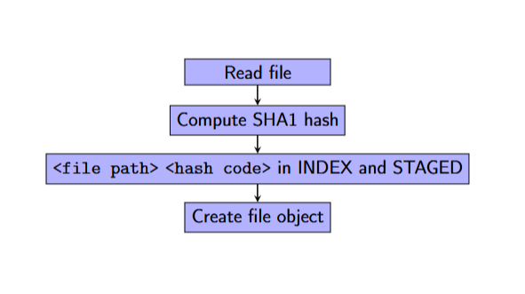
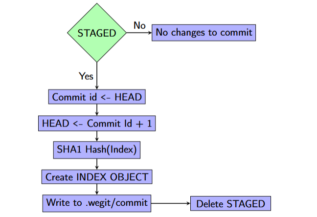
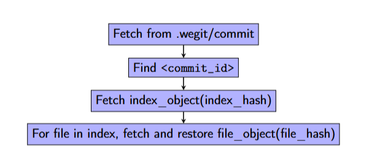

# Commands

Here's an in detailed explanation of what is supposed to go on in each command implemented so far. 

## Init 
`rgit init` / `rgit init <directory_name>`

Init is used to initialize a directory as a git repository. The sequence of actions when ```rgit init``` is run is as follows:

1. A new directory (folder) is created with the directory name passed as an argument. If no directory name is passed, the current directory name is taken as the directory name

2. A ```.rgit``` folder in the directory

3. A ```config.toml``` file in the ```.rgit``` that contains the configurations.

4. The local config.toml should derive the [user] field from the global config.toml. This is set up using configsetup.

6. A `file_objects` and `index_objects` folder to store the compressed contents of the file when git add is performed and git commit are performed respectively.

## Add
`rgit add <file_path>`

Add is used to stage files to be committed. The steps involved are as follows:

1. Addition of ```<file path> <file hash>``` to the index and staged file in `.rgit`

2. Creation of a compressed version of the file in the ```file_objects``` folder of the `.rgit`

RGit stores these objects using SHA-1 hashing and organizes them in subdirectories based on the first two characters of the hash (similar to the actual git).`rgit/objects/<first two characters of the SHA-1 hash>/<remaining characters of the SHA-1 hash>.`



## Commit
`rgit commit <message>`

Commit solidifies the staged changes byt creating a snapshot of the index at that point of time. The major steps are:

1. Checking if the `staged` area exists, if it doesn't it means that there are no changes to commit. This check prevents duplicate commit creation. Else, continue.

2. Fetching of the commit id from `HEAD`. The commit id is then updated as `commit_id + 1` and written back to `HEAD`.

3. Creation of a SHA-1 hash of the index file and storage in `.rgit/index_objects`. A corresponding commit object is created using the id, hash and message and then stored in the `.rgit/commit` file.

4. Deletion of the `staged` area.

A comprehensive overview of what happens can be described in the flowchart as follows:



## Log
`rgit log`

Log returns a list of all the commits to the console. This can help understanding which commit to jumpto/checkout. The log function reads from the `.rgit/commit` TOML file.

## JumpTo
`rgit jump-to <commit_id>`

JumpTo helps navigate to a specific commit in history (or future as of now, only partially similar to checkout). The steps are as follows:

1. Fetching of all commit objects from `.rgit/commit` and finding out the one that corresponds to `commit id` passed as a parameter.

2. Restoration of index contents by reading corresponding index hash from `.rgit/index_objects` and decompression of it

3. For all filepaths and hashes in the restored index, restoration of file contents by reading file hash and fetching from `.rgit/file_objects`.



